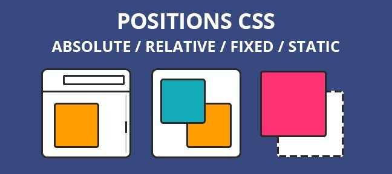

# **CSS Positioning 101**
---
- ### **Objetivo**
Resolver los ejercicios de la página de ***Noah Stokes*** con el fin de poner en práctica los fundamentos de ***position***.

- ### **Contenido**
 1. **Example A:** Uso de _valor static_.

 2. **Example B:** Uso de _valor relative_.

 3. **Example C:** Uso de _valor relative_ con posición en acción.

 4. **Examples D, E, F, G, H, H2 y H3:** Uso de _valor absolute_.

 5. **Examples i - j:** sitios web usando _Positioning_.

 - ### **Conclusión**
Al conocer cómo funciona y cómo pueden aplicarse los distintos valores de la propiedad ***position*** se pueden crear innumerables diseños.

 
